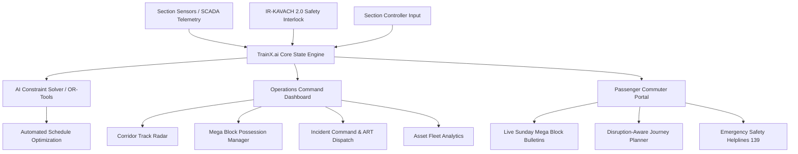

# TrainX.ai (TrainX)
### Next-Gen AI-Powered Automatic Block Planning & Emergency Disruption Management for Indian Railways (भारतीय रेल)

[](https://reactjs.org/)
[](https://www.typescriptlang.org/)
[](https://vitejs.dev/)
[](https://opensource.org/licenses/MIT)
[](http://makeapullrequest.com)

**TrainX.ai** is an enterprise-grade railway operations command system and passenger disruption management platform tailored for Indian Railways (CRIS / IR-KAVACH). Styled with a high-density, eye-pleasing BookMyShow-inspired aesthetic (`#F84464` crimson red, `#333545` slate navy, `#222434` dark footer, and `#F5F5FA` off-white canvas).

---

## 🌟 Key Features

### 1. 🎛️ Operations Controller & Dispatcher Command Console
- **Corridor Track Availability Radar**: Real-time track occupancy (🟢 Clear, 🟡 Mega Block / Maintenance, 🔴 Emergency / Cordoned, 🔵 Speed Restrictions) with an interactive section inspector for active trains and line capacity.
- **AI Auto-Block Optimization Engine & Solver Studio**: Multi-objective constraint solver with customizable penalty weights, **Before vs After KPI benchmark** (Asset utilization boosted to 95.8%, delays reduced by 89%), and a **24-Hour Gantt Timeline** of track possessions.
- **Mega Block & Corridor Possession Manager**: Form to schedule and authorize track possessions (Tamping, OHE wire maintenance, Bridge girders, Kavach EI upgrades), manage assigned machinery, and auto-dispatch passenger advisories.
- **Accident & Emergency Incident Center**: Rapid SOS incident intake with automatic signal lockdown (Red), Accident Relief Train (ART/SP-ARME) dispatch tracker, emergency siren chimes, and public safety broadcast generator.
- **Asset Fleet & Utilization Reports**: Telemetry on locomotives, crew gang rosters, tamping machines, and one-click JSON report export.

### 2. 🚆 Passenger & Commuter Live Portal (रेल यात्री साथी - Rail Yatri Saathi)
- **Sunday Mega Block Bulletins**: Suburban & express corridor disruption alerts with alternate train halts and municipal feeder bus options (BEST, DTC).
- **Emergency Safety Advisories**: Transparent incident notifications with direct 24x7 helpline links (**139 RailMadad**, **1512 GRP**, **182 Women Safety**).
- **AI Smart Disruption-Aware Journey Planner**: Route finder that intelligently circumvents active mega blocks with multimodal transit connections.

### 3. 🧪 Interactive Scenario Sandbox
- One-click triggers in the top bar to **Simulate an Incident (OHE Snap)**, **Simulate Sunday Mega Block**, **Execute AI Constraint Solver** (with celebratory confetti), or **Reset Network State**.

---

## 🏛️ System Architecture & Workflow



---

## 🛠️ Technology Stack

- **Frontend**: React 18 (TypeScript)
- **Bundler / Dev Server**: Vite
- **Styling**: Vanilla CSS Design System with BookMyShow-inspired aesthetic tokens
- **Icons**: Lucide React
- **Audio Synthesis**: Web Audio API (real-time emergency siren & harmonic optimization chords)
- **Effects**: Canvas Confetti

---

## 📂 Project Structure

```
rail-block-planner/
├── .github/
│   └── workflows/
│       └── ci.yml              # Automated GitHub Actions CI workflow
├── src/
│   ├── components/
│   │   ├── Header.tsx           # Sticky BookMyShow style header & division switcher
│   │   ├── HeroCarousel.tsx     # Carousel banner with interactive navigation
│   │   ├── LiveAlertBanner.tsx  # High-priority emergency and mega block banners
│   │   ├── SimulationControls.tsx # Sandbox scenario toolbar
│   │   ├── passenger/
│   │   │   └── PassengerPortal.tsx # Commuter bulletins & route finder
│   │   └── planner/
│   │       ├── PlannerDashboard.tsx       # Operations master console
│   │       ├── InteractiveTrackMap.tsx    # Corridor radar & section inspector
│   │       ├── AiBlockOptimizer.tsx       # Constraint solver & Gantt timeline
│   │       ├── MegaBlockManager.tsx       # Possession scheduling & authorization
│   │       ├── AccidentIncidentManager.tsx # SOS incident triage & ART tracker
│   │       └── AssetAnalyticsView.tsx     # Machine health & JSON report exporter
│   ├── context/
│   │   └── RailwayContext.tsx   # Global reactive state, event triggers & solver
│   ├── data/
│   │   └── mockData.ts          # Comprehensive Indian Railways data models
│   ├── styles/
│   │   └── index.css            # BookMyShow design tokens & UI components
│   ├── types/
│   │   └── railway.ts           # Strict TypeScript interfaces & enums
│   ├── utils/
│   │   └── audioAlert.ts        # Web Audio API alert sound synthesizer
│   ├── App.tsx                  # Root application view & footer
│   └── main.tsx                 # Entrypoint
├── index.html                   # HTML template with Google Fonts
├── package.json                 # Project dependencies & scripts
├── tsconfig.json                # TypeScript compiler configuration
├── vite.config.ts               # Vite configuration
├── LICENSE                      # MIT License
└── README.md                    # Project documentation
```

---

## 🚀 Quick Start Guide

### Prerequisites
- Node.js (v18 or higher)
- npm (v9 or higher)

### 1. Clone the Repository
```bash
git clone https://github.com/your-username/rail-block-planner.git
cd rail-block-planner
```

### 2. Install Dependencies
```bash
npm install
```

### 3. Run Locally in Development Mode
```bash
npm run dev
```
Open your browser at [http://localhost:3000](http://localhost:3000) (or the port shown in terminal).

### 4. Build for Production
```bash
npm run build
```
The optimized production bundle will be generated in the `dist/` directory.

### 5. Preview Production Build
```bash
npm run preview
```

---

## 🚢 Deploying to GitHub / Cloud

### Deploying to Vercel / Netlify
1. Push this repository to GitHub.
2. Import the repository in [Vercel](https://vercel.com) or [Netlify](https://netlify.com).
3. Set build command to `npm run build` and output directory to `dist`.
4. Deploy!

### GitHub Actions CI
A GitHub Actions workflow is pre-configured in [`.github/workflows/ci.yml`](.github/workflows/ci.yml) to automatically run typechecking (`tsc`) and verify production builds on every push and pull request.

---

## 📄 License
This project is licensed under the [MIT License](LICENSE).

---

**Built with pride for Indian Railways (भारतीय रेल) & Centre for Railway Information Systems (CRIS).**
